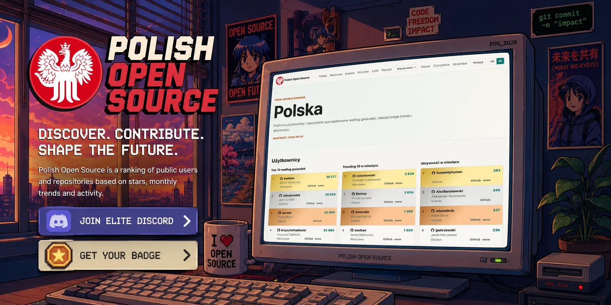

  
  <h1 align="center">Polish Open Source</h1>

  

    Public users, repositories, organizations, and packages from Poland ranked by stars, monthly trend, activity, and registry metrics.
  

  

    <a href="#mission">Mission</a> ·
    <a href="#rankings">Rankings</a> ·
    <a href="#packages">Packages</a> ·
    <a href="#discord">Discord</a> ·
    <a href="#badge">Badge</a> ·
    <a href="#data-sources">Data Sources</a> ·
    <a href="#open-source">Open Source</a>
  

## Mission

Polish Open Source recognizes developers and organizations who contribute to open source and encourages creating free software. The ranking helps discover active people, repositories, packages, and local technical communities connected with Poland.

## Rankings

Rankings are built from public data available through the GitHub, GitLab, and Codeberg APIs. The project does not include private repositories, private commits, or activity that is not publicly visible.

People enter the ranking when their public location points to Poland, contains `Polska` or `Poland`, or points to a Polish city above 100,000 residents. Organizations are filtered more strictly: if the location points to both Poland and another country, the organization does not enter the Polish ranking.

The main ranking shows the total number of stars received. The popularity ranking shows the star increase in a given month. User activity means merged public pull requests from that month into repositories they do not own. Repository metrics include only repositories that reached at least 5 stars.

Public rankings show the top 100. Ties are deterministic: first by platform, then alphabetically by user login, organization login, or full repository name.

## Packages

Polish Open Source detects packages connected to Polish open-source repositories. Files in the default branch and manifests characteristic for specific ecosystems are analyzed. Technical directories and dependency directories are skipped, including `.git`, `build`, `dist`, `node_modules`, `target`, and `vendor/bundle`.

Supported ecosystems include npm, RubyGems, crates.io, PyPI, Hex, Packagist, Go, Homebrew, NuGet, Maven, Terraform, Conan, vcpkg, Swift Package Manager, Pub, APT, RPM, Nix, CRAN, CPAN, Hackage, Clojars, Julia, and Conda.

Detection is based on manifests such as `package.json`, `.gemspec`, `Cargo.toml`, `pyproject.toml`, `composer.json`, `go.mod`, `pom.xml`, `Package.swift`, `pubspec.yaml`, `flake.nix`, `DESCRIPTION`, `.cabal`, `Project.toml`, and `environment.yml`. If a repository contains many manifests, it can be linked to more than one ecosystem.

Each ecosystem has rankings by repository stars and by monthly repository star growth. When the package registry exposes the data, package-specific rankings are available as well:

- Downloads in the last 30 days: npm, crates.io, Packagist, and Homebrew.
- Total downloads: crates.io, RubyGems, Hex, Packagist, and NuGet.
- Dependent package count: RubyGems.

## Discord

Discord is intended for people who are present in the Polish Open Source data.

After signing in with GitHub, the Discord invite is visible on the profile page. You can connect your Discord account there, and the application checks your ranking profile. The bot synchronizes access and server roles.

Roles and available channels come from the latest public snapshot. They can depend on Poland rank, city rank, repository languages, and the highest ranking positions. If you do not have access, check your public location, update it on the platform with your repositories, and wait for the next snapshot.

## Badge

A badge is a public SVG badge that you can embed in your GitHub profile or a repository README. It is generated from the latest public snapshot and updates after the next ranking run.

A repository badge shows the project position. If the repository language is recognized, the label can use a shorter language form, for example Polish .rb Repo or Polish .js Repo.

You can download the badge from your profile page after signing in with GitHub. The profile page includes a badge preview and ready-to-copy Markdown.

Profile badge hierarchy:

1. If you are in the Poland top 100, the badge shows Polish Open Source and your country ranking position.
2. If you are not in the Poland top 100 but you are in your city top 10, the badge shows the city name and Elite, for example Krakow Elite.
3. If you are not in the city top 10 but you are in the city top 100, the badge shows the city name and Top 100, for example Krakow Top 100.
4. If you are outside the Poland top 100 and outside the city top 100, the badge can still be displayed as Polish Open Source.

## Data Sources

GitHub is the primary data source because it provides the best API for searching profiles by location and for fetching repositories, stars, and pull requests.

GitLab and Codeberg are supported on a best-effort basis. Their APIs do not expose the same access to every metric, and in particular they do not support strict location search, so some data can be less complete than on GitHub.

The ranking is a monthly snapshot, not a live view. If data on GitHub changed today, it may appear in the ranking only after the next edition.

## Open Source

The project source code is public. You can inspect how rankings are built, how package detection works, how Discord access is synchronized, and how badges are generated.

Project documentation lives in [docs/README.md](docs/README.md). Agent workflows live in [skills/README.md](skills/README.md).
